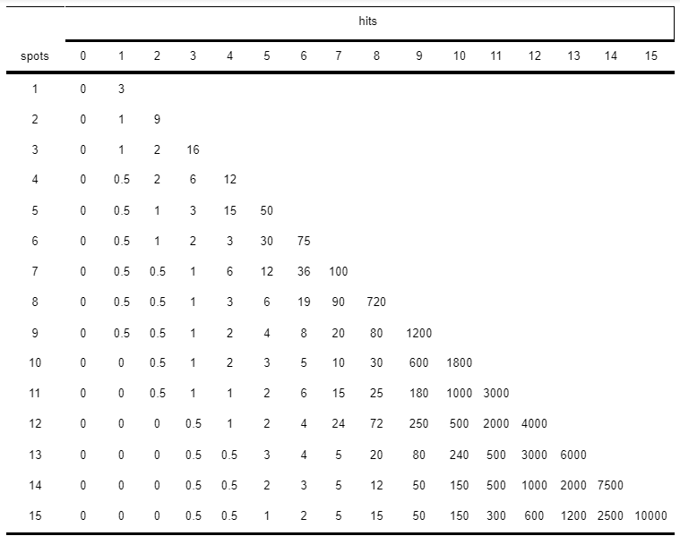

# Trabalho-1
Repositório contendo as especificações do Trabalho 1 da disciplina de LP1

# Jogo Keno

**Keno** é um jogo de apostas muito popular parecido com loteria ou bingo.

Os jogadores apostam escolhendo entre 1 e 15 números únicos no intervalo [1, 80] e definem o número de rodadas e a quantidade de crédito inicial, que será dividido entre as rodadas. 

Depois que uma aposta válida é processada, o jogo executa o número especificado de rodadas, apostando em cada rodada um valor igual a Crédito Inicial / Número de Rodadas. Para cada rodada o jogo gera vinte números aleatórios entre 1 e 80. Os números apostados pelo jogador, chamados de spots, são comparados com os números sorteados para determinar quantos números o jogador acertou naquela rodada. 

O conjunto dos números que o jogador acertou são chamados de hits. O número de hits determina o fator de retorno que é multiplicado pelo valor apostado naquele turno, determinando, assim, se o jogador ganha ou perde dinheiro.

O fator de retorno vem da tabela de retorno. Essa tabela determina o fator de retorno de uma rodada com base no valor apostado, na quantidade de números apostados e na quantidade de hits daquela rodada. A tabela que o jogo usa está definida abaixo:



Cada linha corresponde a uma escala de retorno com base na quantidade de spots. Por exemplo, suponha que um jogador aposta 100 créditos em uma cartela com 5 spots e obtém 3 hits (o valor de retorno, de acordo com a tabela é 3); Neste caso, o jogador ganha 300 créditos naquela rodada.

# Como jogar

Para jogar este jogo você só precisa carregar seu arquivo de aposta na pasta `data`, o arquivo precisa ter uma extensão de texto simples (` .dat`, `.txt`, `...`).

Logo abaixo é possível visualizar um exemplo válido de texto para um arquivo de apostas.

```
1500.0
3
21 12 64
```

As três linhas ilustradas para arquivo de apostas significam, em ordem:
* Número real representando a quantidade de crédito inicial do jogador;
* Número inteiro representando a quantidade de rodadas que serão executadas;
* Conjunto de até 15 números inteiros únicos em qualquer ordem separados por espaço.

Quando algum requisito não for satisfeito, a aposta será rejeitada e uma mensagem de erro correspondente deverá ser impressa.

Após carregar seu arquivo de aposta, você deverá compilar o programa e executar o executável .

Para compilar, você só precisa colocar isso no terminal:

1. Entre na pasta de arquivo, no caso `data`:
```
cd build
```
2. Execute os comandos do `cmake` para gerar os arquivos intermediários e o executável dentro de `build`.
```
cmake ..
cmake --build .
```
Isso criará um executável dentro de `build` chamado de `KenoRun`.

Logo após a compilação, para executar o programa gerado use os comandos:

```
./KenoRun nome_do_arquivo.dat
```

Por exemplo, se o nome do seu arquivo for "aposta":
```
./KenoRun aposta.dat
```

Se nenhum arquivo de aposta foi especificado, o programa será executado com um arquivo de aposta demo ( localizado em `data / default_bet.dat`).
